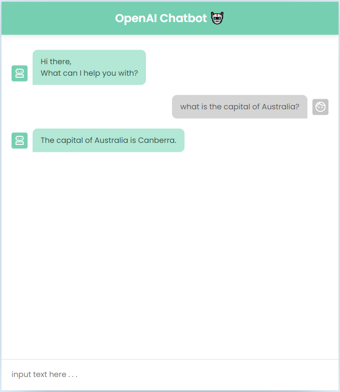

OpenAI Chatbot
=========
ChatGPT is so popular nowadays. Everybody can use ChatGPT to help their daily job or assignment.
This project is to practice the skill that working with third-party API (OpenAI API) while handling data.
One of the features in this project is that Node.JS is adopted to act as the backend server. Then the 
sensitive information such as API key (or username/pw) won't be seen by common users.<br>

Link of live demo page can be found at: <br>
https://rexxwei.github.io/portfolio/


Dependence
----
To make this project work, below features or information must be ready beforehand in the environment. 
  - Node.JS
  - express
  - A valid OpenAI API key<br>

To deploy the project online, additional feature are required to make the service available.
  - pm2


How to Use
----
In the project directory, run the file 'app.js' in terminal.<br>
```css
node app.js
```
Then open a browser and try the address, eg.<br>
```css
localhost:5000
```


Demo
=========

